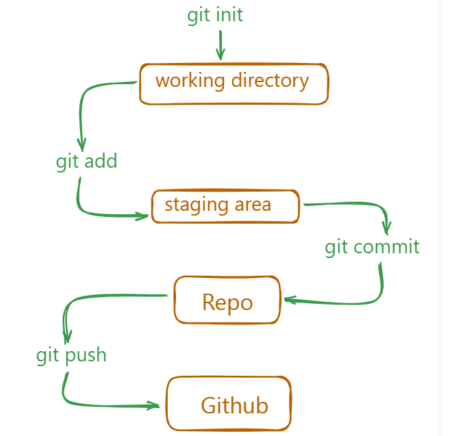

# Git and Github
- Git is a version control system that allows you to manage the history of your code, track changes to your files and to collaborate with others. Version control systems are essential for software development.

## Git and Github are different

Git is a version control system that is used to track changes to your files. It is a free and open-source software that is available for Windows, macOS, and Linux. Remember, GIT is a software and can be installed on your computer.

Github is a web-based hosting service for Git repositories. Github is an online platform that allows you to store and share your code with others.

### Repository
A repository is a collection of files and directories that are stored together.like a folder on your computer, but it is more than just a folder
>git folder is hidden folder 

## Commands
git add . (or filename )
git log 
git log --

